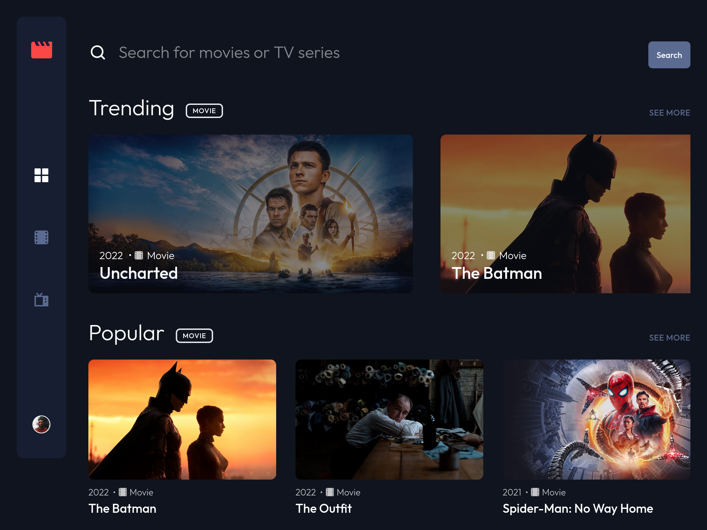
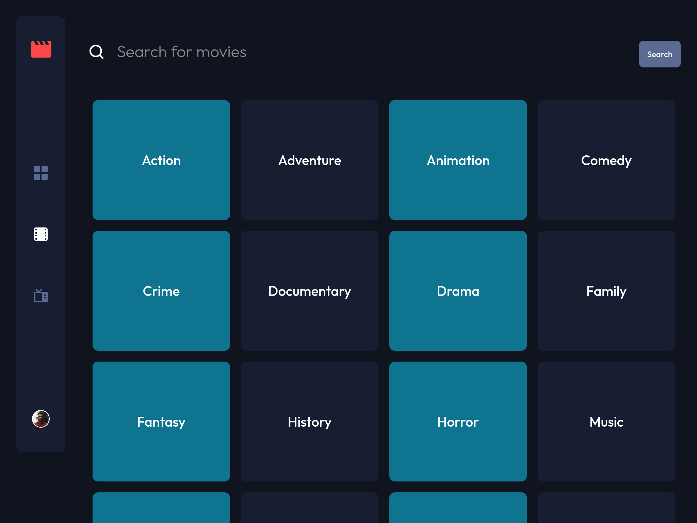
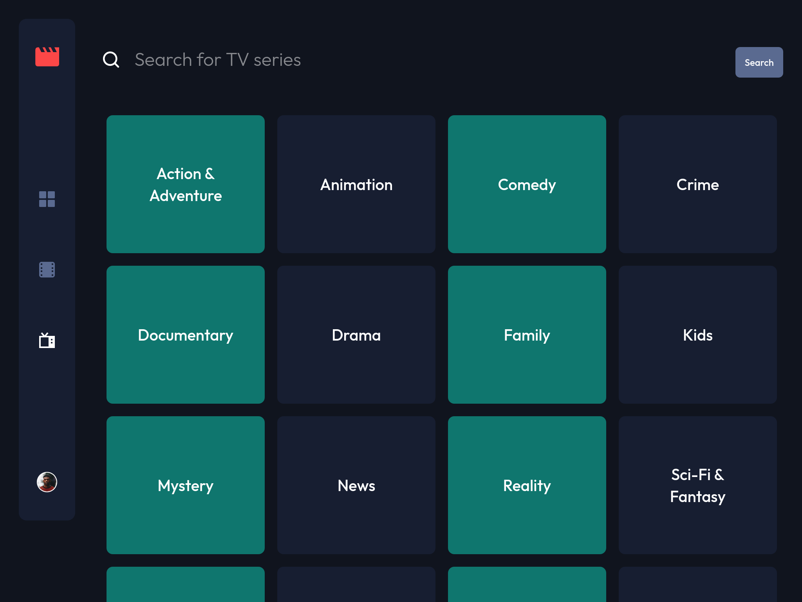
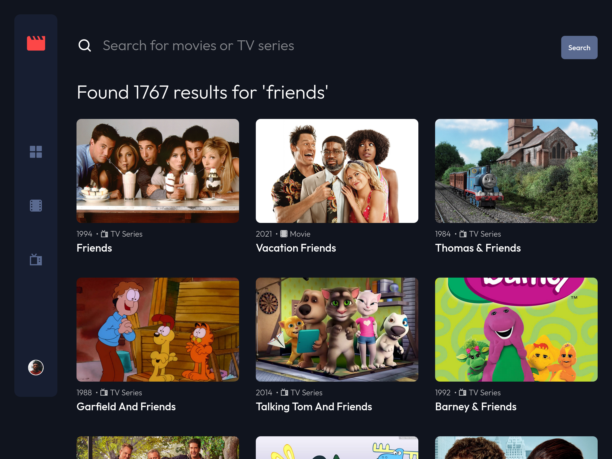
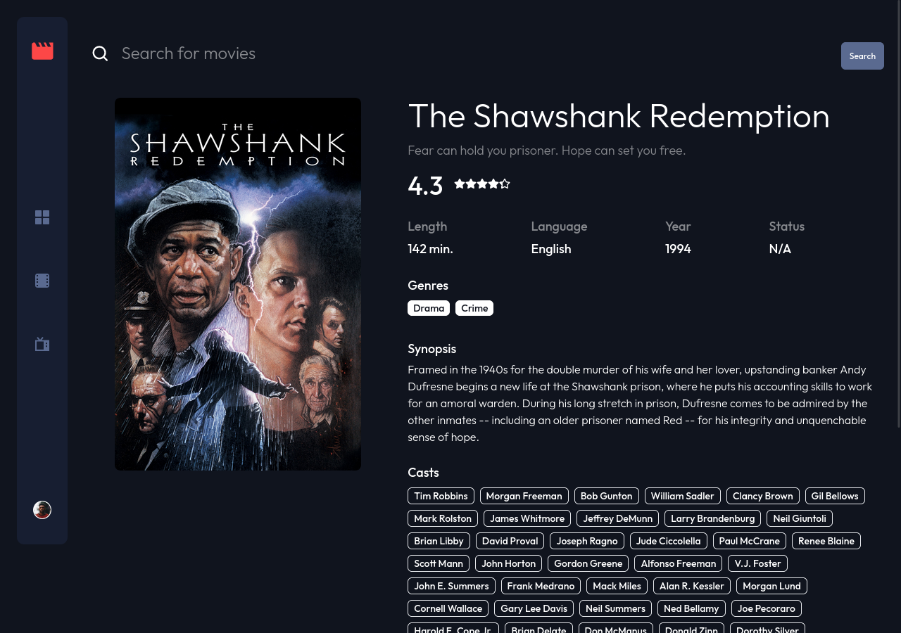

# Entertainment web app

## Table of contents

- [Entertainment web app](#entertainment-web-app)
  - [Table of contents](#table-of-contents)
  - [Overview](#overview)
    - [Summary](#summary)
    - [Links](#links)
    - [Screenshot](#screenshot)
  - [Details](#details)
    - [Project purpose and goal](#project-purpose-and-goal)
    - [Web stack and explanation](#web-stack-and-explanation)
    - [Problem and thought process](#problem-and-thought-process)
    - [Lesson learned](#lesson-learned)
    - [Future improvements](#future-improvements)
    - [Useful resources](#useful-resources)
  - [Getting started](#getting-started)
    - [Prerequisites](#prerequisites)
    - [Installing](#installing)
  - [Contributing](#contributing)
  - [Author](#author)
  - [Acknowledgments](#acknowledgments)

## Overview

### Summary

An entertainment web app built with Next.js and TailwindCSS that allows users to search for movies and tv shows.

### Screenshot












### Future improvements

- [ ] Add a bookmark page to store the user's favorite movies and tv shows
- [ ] Add the video playing feature when the user hover over the card and play the video
- [ ] Add authentication so that the user can sign up and log in to save their favorite movies and tv shows permanently
- [ ] Adjust the size of the card item in the last row so that the image won't be stretched out

### Useful resources

- [Solution for Cannot read Property 'slice' of Undefined](https://bobbyhadz.com/blog/javascript-cannot-read-property-slice-of-undefined)
- [How to get all available pages in the same request?](https://www.themoviedb.org/talk/55aa2a76c3a3682d63002fb1?language=en)


1. Create an API KEY for the [TMDB API](https://www.themoviedb.org/documentation/api)
2. Create an `.env.local` file in the root directory of the project
3. Add 2 environment variables to the `.env.local` file:
```env
// .env.local

TMDB_ENDPOINT="https://api.themoviedb.org/3"
TMDB_API_KEY="YOUR_TMDB_API_KEY"
```
